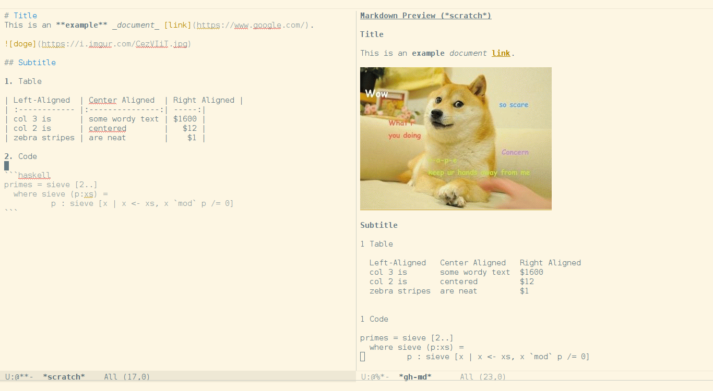

# gh-md - Render markdown using the Github api

*Author:* Mario Rodas <marsam@users.noreply.github.com> 
*Version:* 0.1 

Render markdown using the [Github API](https://developer.github.com/v3/markdown/).

## Usage

After install `gh-md.el` you can use the functions
`gh-md-render-region` and `gh-md-render-buffer` to generate a
preview of the markdown content of a buffer.

---
Converted from `gh-md.el` by [*el2markdown*](https://github.com/Lindydancer/el2markdown).
